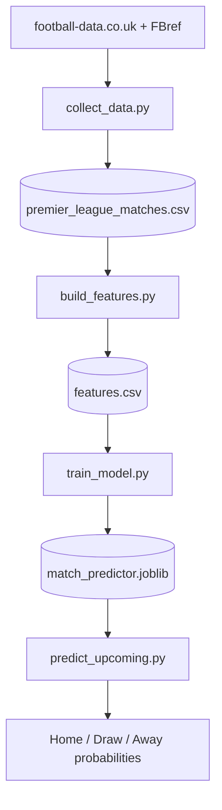

# Premier League Match Predictor

A machine learning pipeline that predicts English Premier League match outcomes (home win / draw / away win) from historical data, outputs win probabilities for upcoming fixtures, and projects individual player performance for the following season.

Trained on 11 seasons of Premier League results, the match model reaches **49.5% accuracy** on a held-out season, beating the majority-class baseline of 42.6%. For context, professional bookmakers and published academic models typically land around 50 to 53% on this task, so the model performs close to that range.

## Results

| Model | Test accuracy | Baseline |
|-------|---------------|----------|
| Logistic Regression | **49.5%** | 42.6% |
| Random Forest | 47.6% | 42.6% |

The model was trained on seasons 2015/16 through 2024/25 and tested on the 2025/26 season (380 matches it never saw during training), which is the honest way to evaluate a predictor: on the future, not on a random shuffle of the past.

## How it works

The pipeline runs in five stages, each producing a file the next stage reads:



### Feature engineering

Raw match results cannot be fed to a model directly, because at prediction time the score is unknown. Each match is converted into signals that exist *before* kickoff:

- **ELO ratings** - a running strength score for each team that rises after wins and falls after losses, adjusted for home advantage. It carries across seasons, which lets the model estimate the strength of newly promoted teams.
- **Rolling form** - each team's average goals, shots on target, and points over their last 5 matches.

### Avoiding data leakage

The most important design decision. Every feature is computed using only matches that finished *before* the one being predicted. Rolling averages are shifted by one match so a game never contributes to its own features, and each ELO rating is recorded before the match result is applied. Without this discipline a model looks excellent in testing and then fails on real fixtures.

### The draw problem

Like most football models, this one rarely predicts draws as the single most likely outcome, because draws lack a strong statistical signature. The pipeline addresses this by outputting probabilities (for example Home 48%, Draw 27%, Away 25%) rather than hard labels, so draw likelihood is still captured even when it is not the top pick.

## Player performance prediction

A second model predicts individual player output: **goals + assists per 90 minutes for the following season**, based on current-season statistics.

Because player data is season-level, the model learns from season-to-season transitions. It trains on the 2023/24 to 2024/25 transition and is tested on 2024/25 to 2025/26.

The benchmark is *persistence*, simply assuming a player repeats last season's rate. That is a strong baseline in sports, which makes it a fair test.

| Model | MAE | vs baseline |
|-------|-----|-------------|
| Ridge Regression | **0.100** | 17.9% better |
| Random Forest | 0.105 | 14.3% better |
| Baseline (persistence) | 0.122 | — |

### Regression to the mean

The most interesting result is what the model learned about elite seasons. Taking the ten highest-scoring players of 2024/25:

| | Goals + assists per 90 |
|---|---|
| Their 2024/25 rate | 0.885 |
| Model prediction | 0.718 |
| Actual 2025/26 rate | 0.528 |

The model correctly anticipates that outlier seasons regress toward the mean, rather than naively projecting them forward. Mohamed Salah's 1.255 was projected down to 0.875 (actual: 0.587). Erling Haaland is a notable exception, projected at 0.706 but actually improving to 1.067, a reminder that genuine outliers exist.

## SQL analysis

The project data is also loaded into a SQLite database so it can be queried directly with SQL. The queries in `run_queries.py` use CTEs, window functions, conditional aggregation, and joins.

A few findings from the data:

- **Home advantage is declining.** The home win rate fell from 48.4% in 2022/23 to 42.6% in 2025/26. The 2020/21 season, played largely in empty stadiums, shows the lowest rate in the dataset at 37.9%.
- **The ELO ratings track reality.** Joining the model's ratings against actual league points shows close agreement (Arsenal 1st on both measures, Man City 2nd), which validates the rating system against an independent benchmark.
- **Man City lead the 11-season table** with 2.23 points per game and a +606 goal difference, nearly 200 goals clear of second place.

Example query, building an all-time table from match results using a CTE and a window function:

```sql
WITH team_matches AS (
    SELECT HomeTeam AS team, FTHG AS gf, FTAG AS ga,
           CASE FTR WHEN 'H' THEN 3 WHEN 'D' THEN 1 ELSE 0 END AS pts
    FROM matches WHERE FTR IS NOT NULL
    UNION ALL
    SELECT AwayTeam, FTAG, FTHG,
           CASE FTR WHEN 'A' THEN 3 WHEN 'D' THEN 1 ELSE 0 END
    FROM matches WHERE FTR IS NOT NULL
)
SELECT RANK() OVER (ORDER BY SUM(pts) DESC) AS rank,
       team,
       SUM(pts) AS points,
       SUM(gf) - SUM(ga) AS goal_diff,
       ROUND(1.0 * SUM(pts) / COUNT(*), 2) AS pts_per_game
FROM team_matches
GROUP BY team
HAVING COUNT(*) >= 100
ORDER BY points DESC;
```

## Project structure

```
football-predictor/
├── src/
│   ├── collect_data.py           # download historical match data
│   ├── collect_players.py        # scrape player stats (FBref via soccerdata)
│   ├── build_features.py         # engineer leakage-free features
│   ├── train_model.py            # train and evaluate match models
│   ├── predict_upcoming.py       # predict upcoming fixtures
│   ├── predict_players.py        # player-level performance prediction
│   ├── export_dashboard_data.py  # export CSVs for the dashboard
│   ├── build_database.py         # load CSVs into a SQLite database
│   └── run_queries.py            # SQL analysis queries
├── data/                     # datasets (raw data gitignored, sample outputs included)
├── models/                   # trained model (gitignored)
├── requirements.txt
└── README.md
```

## Setup

Requires Python 3.13.

```bash
git clone https://github.com/TakshDA/football-predictor.git
cd football-predictor
python -m venv venv
venv\Scripts\activate
pip install -r requirements.txt
```

## Usage

Run the pipeline in order. Each script reads the file the previous one wrote:

```bash
python src/collect_data.py
python src/collect_players.py
python src/build_features.py
python src/train_model.py
python src/predict_upcoming.py
python src/predict_players.py
python src/export_dashboard_data.py
python src/build_database.py
python src/run_queries.py
```

To predict specific fixtures, create `data/upcoming_fixtures.csv`:

```csv
HomeTeam,AwayTeam
Arsenal,Coventry
Man City,Tottenham
```

Team names must match the spelling used by football-data.co.uk.

## What I learned

- **Data leakage is the defining challenge** in sports prediction. Preventing it changed the entire structure of the feature pipeline.
- **Time-based evaluation is non-negotiable.** A random train/test split would leak future information and inflate accuracy.
- **Probabilities beat labels** for a problem with genuine randomness.
- **Beating the baseline is the real bar,** not raw accuracy. 49.5% only means something once you know the naive baseline is 42.6%. For the player model, the fair benchmark was persistence rather than a league average.
- **Regression to the mean is a real, learnable pattern.** The player model's main advantage over the baseline came from recognising that exceptional seasons rarely repeat.
- **SQL and pandas complement each other.** Aggregate analysis reads more clearly as SQL, while the modeling pipeline is better suited to pandas.

## Future work

- Add a Power BI dashboard to visualize predictions and team form.
- Tune the ELO parameters (K-factor, home advantage) and model hyperparameters.
- Incorporate expected goals (xG) as features, which requires pulling an additional FBref stat type.

## Tech stack

Python, pandas, scikit-learn, SQL (SQLite), soccerdata, joblib. Data from football-data.co.uk and FBref.

## Disclaimer

This project is for educational and portfolio purposes. Predictions are probabilistic estimates and are not betting advice.
