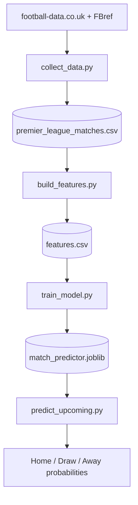

# Premier League Match Predictor
A machine learning pipeline that predicts English Premier League match outcomes (home win / draw / away win) from historical data, and outputs win probabilities for upcoming fixtures.
Trained on 11 seasons of Premier League results, the model reaches **49.5% accuracy** on a held-out season, beating the majority-class baseline of 42.6%. For context, professional bookmakers and published academic models typically land around 50 to 53% on this task, so the model performs close to that range.

## Results

| Model | Test accuracy | Baseline |
|-------|---------------|----------|
| Logistic Regression | **49.5%** | 42.6% |
| Random Forest | 47.6% | 42.6% |

The model was trained on seasons 2015/16 through 2024/25 and tested on the 2025/26 season (380 matches it never saw during training), which is the honest way to evaluate a predictor: on the future, not on a random shuffle of the past.

## How it works

The pipeline runs in five stages, each producing a file the next stage reads:



### Feature engineering

Raw match results cannot be fed to a model directly, because at prediction time the score is unknown. Each match is converted into signals that exist *before* kickoff:

- **ELO ratings** - a running strength score for each team that rises after wins and falls after losses, adjusted for home advantage. It carries across seasons, which lets the model estimate the strength of newly promoted teams.
- **Rolling form** - each team's average goals, shots on target, and points over their last 5 matches.

### Avoiding data leakage

The most important design decision. Every feature is computed using only matches that finished *before* the one being predicted. Rolling averages are shifted by one match so a game never contributes to its own features, and each ELO rating is recorded before the match result is applied. Without this discipline a model looks excellent in testing and then fails on real fixtures.

### The draw problem

Like most football models, this one rarely predicts draws as the single most likely outcome, because draws lack a strong statistical signature. The pipeline addresses this by outputting probabilities (for example Home 48%, Draw 27%, Away 25%) rather than hard labels, so draw likelihood is still captured even when it is not the top pick.

## Project structure

```
football-predictor/
├── src/
│   ├── collect_data.py       # download historical match data
│   ├── collect_players.py    # scrape player stats (FBref via soccerdata)
│   ├── build_features.py     # engineer leakage-free features
│   ├── train_model.py        # train and evaluate models
│   └── predict_upcoming.py   # predict upcoming fixtures
├── data/                     # generated datasets (gitignored)
├── models/                   # trained model (gitignored)
├── requirements.txt
└── README.md
```

## Setup

Requires Python 3.13.

```bash
git clone https://github.com/TakshDA/football-predictor.git
cd football-predictor
python -m venv venv
venv\Scripts\activate
pip install -r requirements.txt
```

## Usage

Run the pipeline in order. Each script reads the file the previous one wrote:

```bash
python src/collect_data.py
python src/collect_players.py
python src/build_features.py
python src/train_model.py
python src/predict_upcoming.py
```

To predict specific fixtures, create `data/upcoming_fixtures.csv`:

```csv
HomeTeam,AwayTeam
Arsenal,Coventry
Man City,Tottenham
```

Team names must match the spelling used by football-data.co.uk.

## What I learned

- **Data leakage is the defining challenge** in sports prediction. Preventing it changed the entire structure of the feature pipeline.
- **Time-based evaluation is non-negotiable.** A random train/test split would leak future information and inflate accuracy.
- **Probabilities beat labels** for a problem with genuine randomness.
- **Beating the baseline is the real bar,** not raw accuracy. 49.5% only means something once you know the naive baseline is 42.6%.

## Future work

- Extend to player-level performance prediction using the collected FBref data.
- Add a Power BI dashboard to visualize predictions and team form.
- Tune the ELO parameters (K-factor, home advantage) and model hyperparameters.
- Incorporate expected goals (xG) as features.

## Tech stack

Python, pandas, scikit-learn, soccerdata, joblib. Data from football-data.co.uk and FBref.

## Disclaimer

This project is for educational and portfolio purposes. Predictions are probabilistic estimates and are not betting advice.
